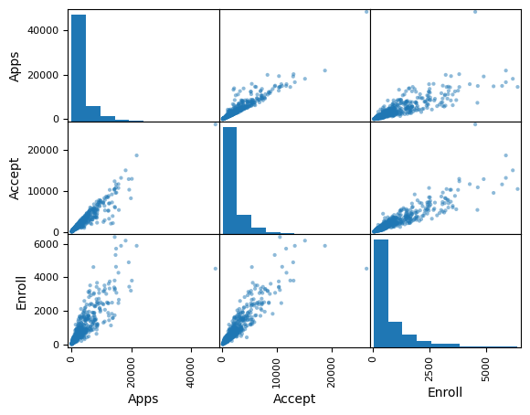

## What Is Statistical Learning?


```python

```


```python
import pandas as pd
import numpy as np
import matplotlib.pyplot as plt
from sklearn import linear_model # regressor
```


```python

```

### Advertising Data


```python
# get Advertising data
Advertising = pd.read_csv(r"Advertising.csv", index_col=0)
```


```python
Advertising.head()
```


<div>
<style scoped>
    .dataframe tbody tr th:only-of-type {
        vertical-align: middle;
    }

    .dataframe tbody tr th {
        vertical-align: top;
    }

    .dataframe thead th {
        text-align: right;
    }
</style>
<table border="1" class="dataframe">
  <thead>
    <tr style="text-align: right;">
      <th></th>
      <th>TV</th>
      <th>radio</th>
      <th>newspaper</th>
      <th>sales</th>
    </tr>
  </thead>
  <tbody>
    <tr>
      <th>1</th>
      <td>230.1</td>
      <td>37.8</td>
      <td>69.2</td>
      <td>22.1</td>
    </tr>
    <tr>
      <th>2</th>
      <td>44.5</td>
      <td>39.3</td>
      <td>45.1</td>
      <td>10.4</td>
    </tr>
    <tr>
      <th>3</th>
      <td>17.2</td>
      <td>45.9</td>
      <td>69.3</td>
      <td>9.3</td>
    </tr>
    <tr>
      <th>4</th>
      <td>151.5</td>
      <td>41.3</td>
      <td>58.5</td>
      <td>18.5</td>
    </tr>
    <tr>
      <th>5</th>
      <td>180.8</td>
      <td>10.8</td>
      <td>58.4</td>
      <td>12.9</td>
    </tr>
  </tbody>
</table>
</div>


### Figure 2.1


```python
fig, (ax1, ax2, ax3) = plt.subplots(1, 3,  figsize=(15, 8))
fig.suptitle('Fig 2.1')
# plot 1
# Fit with lm
regressor = linear_model.LinearRegression().fit(Advertising.loc[:,['TV']], Advertising.loc[:,'sales']) 
ax1.scatter(y = 'sales', x = 'TV', data = Advertising)
ax1.plot(Advertising.loc[:,['TV']], regressor.predict(Advertising.loc[:,['TV']]), '-r')
ax1.set_ylabel("sales"); ax1.set_xlabel("TV")
# plot 2
# Fit with lm
regressor = linear_model.LinearRegression().fit(Advertising.loc[:,['radio']], Advertising.loc[:,'sales']) 
ax2.scatter(y = 'sales', x = 'radio', data = Advertising)
ax2.plot(Advertising.loc[:,['radio']], regressor.predict(Advertising.loc[:,['radio']]), '-r')
ax2.set_ylabel("sales"); ax2.set_xlabel("radio")
# plot 3
regressor = linear_model.LinearRegression().fit(Advertising.loc[:,['newspaper']], Advertising.loc[:,'sales']) 
ax3.scatter(y = 'sales', x = 'newspaper', data = Advertising)
ax3.plot(Advertising.loc[:,['newspaper']], regressor.predict(Advertising.loc[:,['newspaper']]), '-r')
ax3.set_ylabel("sales"); ax3.set_xlabel("newspaper");
```


    

    


```python

```

### Income Dataset


```python
# get Income data
Income1 = pd.read_csv(r"Income1.csv", index_col=0)
```


```python
Income1.head()
```


<div>
<style scoped>
    .dataframe tbody tr th:only-of-type {
        vertical-align: middle;
    }

    .dataframe tbody tr th {
        vertical-align: top;
    }

    .dataframe thead th {
        text-align: right;
    }
</style>
<table border="1" class="dataframe">
  <thead>
    <tr style="text-align: right;">
      <th></th>
      <th>Education</th>
      <th>Income</th>
    </tr>
  </thead>
  <tbody>
    <tr>
      <th>1</th>
      <td>10.000000</td>
      <td>26.658839</td>
    </tr>
    <tr>
      <th>2</th>
      <td>10.401338</td>
      <td>27.306435</td>
    </tr>
    <tr>
      <th>3</th>
      <td>10.842809</td>
      <td>22.132410</td>
    </tr>
    <tr>
      <th>4</th>
      <td>11.244147</td>
      <td>21.169841</td>
    </tr>
    <tr>
      <th>5</th>
      <td>11.645485</td>
      <td>15.192634</td>
    </tr>
  </tbody>
</table>
</div>


```python
fig, (ax1, ax2) = plt.subplots(1, 2,  figsize=(12, 5))
fig.suptitle('Fig 2.2')
# plot 1
ax1.scatter(y = 'Income', x = 'Education', data = Income1)
ax1.set_ylabel("Income"); ax1.set_xlabel("Years of Education")
# plot 2
income_education_model = np.poly1d(np.polyfit(Income1.Education, Income1.Income, 3))
ax2.scatter(Income1.Education, Income1.Income)
ax2.plot(Income1.Education, income_education_model(Income1.Education), '-r')
ax2.vlines(Income1.Education, income_education_model(Income1.Education), Income1.Income) # just wanted to plot those error lines
ax2.set_ylabel("Income"); ax2.set_xlabel("Years of Education");
```


    

    


```python

```

### Income 2 Data


```python
# importing libraries
from mpl_toolkits import mplot3d
import numpy as np
import matplotlib.pyplot as plt
```


```python
# get Income data
Income2 = pd.read_csv(r"Income2.csv", index_col=0)
```


```python
Income2.head()
```


<div>
<style scoped>
    .dataframe tbody tr th:only-of-type {
        vertical-align: middle;
    }

    .dataframe tbody tr th {
        vertical-align: top;
    }

    .dataframe thead th {
        text-align: right;
    }
</style>
<table border="1" class="dataframe">
  <thead>
    <tr style="text-align: right;">
      <th></th>
      <th>Education</th>
      <th>Seniority</th>
      <th>Income</th>
    </tr>
  </thead>
  <tbody>
    <tr>
      <th>1</th>
      <td>21.586207</td>
      <td>113.103448</td>
      <td>99.917173</td>
    </tr>
    <tr>
      <th>2</th>
      <td>18.275862</td>
      <td>119.310345</td>
      <td>92.579135</td>
    </tr>
    <tr>
      <th>3</th>
      <td>12.068966</td>
      <td>100.689655</td>
      <td>34.678727</td>
    </tr>
    <tr>
      <th>4</th>
      <td>17.034483</td>
      <td>187.586207</td>
      <td>78.702806</td>
    </tr>
    <tr>
      <th>5</th>
      <td>19.931034</td>
      <td>20.000000</td>
      <td>68.009922</td>
    </tr>
  </tbody>
</table>
</div>


```python
from matplotlib import cm
from matplotlib.ticker import LinearLocator, FormatStrFormatter
from mpl_toolkits.mplot3d import Axes3D

fig, ax = plt.subplots(subplot_kw={"projection": "3d"})

# syntax for plotting
ax.plot_trisurf(
    Income2.Income, Income2.Education, Income2.Seniority, cmap=cm.jet, linewidth=0.2
)
ax.set_title('Surface plot geeks for geeks')
plt.show();
```


    

    


```python

```


```python

```


```python

```


```python

```


```python

```


```python

```


```python

```


```python

```


```python

```


```python

```


```python

```


```python

```


```python

```


```python

```


```python

```


```python

```


```python

```


```python

```


```python

```


```python

```

### Stock Market Data


```python
# get wages data
Smarket = pd.read_csv(r"Smarket.csv")
```


```python
Smarket.head()
```


<div>
<style scoped>
    .dataframe tbody tr th:only-of-type {
        vertical-align: middle;
    }

    .dataframe tbody tr th {
        vertical-align: top;
    }

    .dataframe thead th {
        text-align: right;
    }
</style>
<table border="1" class="dataframe">
  <thead>
    <tr style="text-align: right;">
      <th></th>
      <th>Year</th>
      <th>Lag1</th>
      <th>Lag2</th>
      <th>Lag3</th>
      <th>Lag4</th>
      <th>Lag5</th>
      <th>Volume</th>
      <th>Today</th>
      <th>Direction</th>
    </tr>
  </thead>
  <tbody>
    <tr>
      <th>0</th>
      <td>2001</td>
      <td>0.381</td>
      <td>-0.192</td>
      <td>-2.624</td>
      <td>-1.055</td>
      <td>5.010</td>
      <td>1.1913</td>
      <td>0.959</td>
      <td>Up</td>
    </tr>
    <tr>
      <th>1</th>
      <td>2001</td>
      <td>0.959</td>
      <td>0.381</td>
      <td>-0.192</td>
      <td>-2.624</td>
      <td>-1.055</td>
      <td>1.2965</td>
      <td>1.032</td>
      <td>Up</td>
    </tr>
    <tr>
      <th>2</th>
      <td>2001</td>
      <td>1.032</td>
      <td>0.959</td>
      <td>0.381</td>
      <td>-0.192</td>
      <td>-2.624</td>
      <td>1.4112</td>
      <td>-0.623</td>
      <td>Down</td>
    </tr>
    <tr>
      <th>3</th>
      <td>2001</td>
      <td>-0.623</td>
      <td>1.032</td>
      <td>0.959</td>
      <td>0.381</td>
      <td>-0.192</td>
      <td>1.2760</td>
      <td>0.614</td>
      <td>Up</td>
    </tr>
    <tr>
      <th>4</th>
      <td>2001</td>
      <td>0.614</td>
      <td>-0.623</td>
      <td>1.032</td>
      <td>0.959</td>
      <td>0.381</td>
      <td>1.2057</td>
      <td>0.213</td>
      <td>Up</td>
    </tr>
  </tbody>
</table>
</div>


```python
fig, (ax1, ax2, ax3) = plt.subplots(1, 3,  figsize=(15, 8))
fig.suptitle('Fig 1.1')
# plot 1
grouped = Smarket.groupby('Direction')['Lag1']
ax1.boxplot(x=[group.values for name, group in grouped],
           tick_labels= grouped.groups.keys() )
ax1.set_ylabel("Percentage Change in S&P"); ax1.set_xlabel("Today's Direction");
ax1.set_title("Yesterday")
# plot 2
grouped = Smarket.groupby('Direction')['Lag2']
ax2.boxplot(x=[group.values for name, group in grouped],
           tick_labels= grouped.groups.keys() )
ax2.set_title("Two Days Before")
ax2.set_ylabel("Percentage Change in S&P"); ax2.set_xlabel("Today's Direction");
# plot 3
grouped = Smarket.groupby('Direction')['Lag3']
ax3.boxplot(x=[group.values for name, group in grouped],
           tick_labels= grouped.groups.keys() )
ax3.set_title("Three Days Before")
ax3.set_ylabel("Percentage Change in S&P"); ax3.set_xlabel("Today's Direction");
```


    

    


```python
from sklearn.discriminant_analysis import QuadraticDiscriminantAnalysis
import numpy as np
```


```python
# train and test data
train_data = Smarket[Smarket['Year'] < 2005]
test_data = Smarket[Smarket['Year']>= 2005]
#
clf = QuadraticDiscriminantAnalysis()
clf.fit(train_data.iloc[:,0:8], train_data.loc[:,'Direction']);
```


```python
pred_data_test = pd.DataFrame(
    clf.predict_proba(test_data.iloc[:,0:8])
)
pred_data_test.columns = ["DOWN", "UP"]
```


```python
plt.boxplot(
    pred_data_test
);
```


    

    


```python

```

### Gene Expression Data


```python
# get wages data
# pd.read_csv(r"D:\DATAPROJECTS\ISLR\data/ALL CSV FILES - 2nd Edition/")
```


```python

```

# Exercise Applied

## Q8


```python
import pandas as pd
import matplotlib.pyplot as plt
```

### (a)


```python
College = pd.read_csv("College.csv", index_col=0)
```


```python
College.head()
```


<div>
<style scoped>
    .dataframe tbody tr th:only-of-type {
        vertical-align: middle;
    }

    .dataframe tbody tr th {
        vertical-align: top;
    }

    .dataframe thead th {
        text-align: right;
    }
</style>
<table border="1" class="dataframe">
  <thead>
    <tr style="text-align: right;">
      <th></th>
      <th>Private</th>
      <th>Apps</th>
      <th>Accept</th>
      <th>Enroll</th>
      <th>Top10perc</th>
      <th>Top25perc</th>
      <th>F.Undergrad</th>
      <th>P.Undergrad</th>
      <th>Outstate</th>
      <th>Room.Board</th>
      <th>Books</th>
      <th>Personal</th>
      <th>PhD</th>
      <th>Terminal</th>
      <th>S.F.Ratio</th>
      <th>perc.alumni</th>
      <th>Expend</th>
      <th>Grad.Rate</th>
    </tr>
  </thead>
  <tbody>
    <tr>
      <th>Abilene Christian University</th>
      <td>Yes</td>
      <td>1660</td>
      <td>1232</td>
      <td>721</td>
      <td>23</td>
      <td>52</td>
      <td>2885</td>
      <td>537</td>
      <td>7440</td>
      <td>3300</td>
      <td>450</td>
      <td>2200</td>
      <td>70</td>
      <td>78</td>
      <td>18.1</td>
      <td>12</td>
      <td>7041</td>
      <td>60</td>
    </tr>
    <tr>
      <th>Adelphi University</th>
      <td>Yes</td>
      <td>2186</td>
      <td>1924</td>
      <td>512</td>
      <td>16</td>
      <td>29</td>
      <td>2683</td>
      <td>1227</td>
      <td>12280</td>
      <td>6450</td>
      <td>750</td>
      <td>1500</td>
      <td>29</td>
      <td>30</td>
      <td>12.2</td>
      <td>16</td>
      <td>10527</td>
      <td>56</td>
    </tr>
    <tr>
      <th>Adrian College</th>
      <td>Yes</td>
      <td>1428</td>
      <td>1097</td>
      <td>336</td>
      <td>22</td>
      <td>50</td>
      <td>1036</td>
      <td>99</td>
      <td>11250</td>
      <td>3750</td>
      <td>400</td>
      <td>1165</td>
      <td>53</td>
      <td>66</td>
      <td>12.9</td>
      <td>30</td>
      <td>8735</td>
      <td>54</td>
    </tr>
    <tr>
      <th>Agnes Scott College</th>
      <td>Yes</td>
      <td>417</td>
      <td>349</td>
      <td>137</td>
      <td>60</td>
      <td>89</td>
      <td>510</td>
      <td>63</td>
      <td>12960</td>
      <td>5450</td>
      <td>450</td>
      <td>875</td>
      <td>92</td>
      <td>97</td>
      <td>7.7</td>
      <td>37</td>
      <td>19016</td>
      <td>59</td>
    </tr>
    <tr>
      <th>Alaska Pacific University</th>
      <td>Yes</td>
      <td>193</td>
      <td>146</td>
      <td>55</td>
      <td>16</td>
      <td>44</td>
      <td>249</td>
      <td>869</td>
      <td>7560</td>
      <td>4120</td>
      <td>800</td>
      <td>1500</td>
      <td>76</td>
      <td>72</td>
      <td>11.9</td>
      <td>2</td>
      <td>10922</td>
      <td>15</td>
    </tr>
  </tbody>
</table>
</div>


### (b)


```python
college2 = pd.read_csv('College.csv')
college3 = college2.rename({'Unnamed: 0': 'College'}, axis=1)
college3 = college3.set_index('College')
```


```python
college2.head(1)
```


<div>
<style scoped>
    .dataframe tbody tr th:only-of-type {
        vertical-align: middle;
    }

    .dataframe tbody tr th {
        vertical-align: top;
    }

    .dataframe thead th {
        text-align: right;
    }
</style>
<table border="1" class="dataframe">
  <thead>
    <tr style="text-align: right;">
      <th></th>
      <th>Unnamed: 0</th>
      <th>Private</th>
      <th>Apps</th>
      <th>Accept</th>
      <th>Enroll</th>
      <th>Top10perc</th>
      <th>Top25perc</th>
      <th>F.Undergrad</th>
      <th>P.Undergrad</th>
      <th>Outstate</th>
      <th>Room.Board</th>
      <th>Books</th>
      <th>Personal</th>
      <th>PhD</th>
      <th>Terminal</th>
      <th>S.F.Ratio</th>
      <th>perc.alumni</th>
      <th>Expend</th>
      <th>Grad.Rate</th>
    </tr>
  </thead>
  <tbody>
    <tr>
      <th>0</th>
      <td>Abilene Christian University</td>
      <td>Yes</td>
      <td>1660</td>
      <td>1232</td>
      <td>721</td>
      <td>23</td>
      <td>52</td>
      <td>2885</td>
      <td>537</td>
      <td>7440</td>
      <td>3300</td>
      <td>450</td>
      <td>2200</td>
      <td>70</td>
      <td>78</td>
      <td>18.1</td>
      <td>12</td>
      <td>7041</td>
      <td>60</td>
    </tr>
  </tbody>
</table>
</div>


```python
college3.head(1)
```


<div>
<style scoped>
    .dataframe tbody tr th:only-of-type {
        vertical-align: middle;
    }

    .dataframe tbody tr th {
        vertical-align: top;
    }

    .dataframe thead th {
        text-align: right;
    }
</style>
<table border="1" class="dataframe">
  <thead>
    <tr style="text-align: right;">
      <th></th>
      <th>Private</th>
      <th>Apps</th>
      <th>Accept</th>
      <th>Enroll</th>
      <th>Top10perc</th>
      <th>Top25perc</th>
      <th>F.Undergrad</th>
      <th>P.Undergrad</th>
      <th>Outstate</th>
      <th>Room.Board</th>
      <th>Books</th>
      <th>Personal</th>
      <th>PhD</th>
      <th>Terminal</th>
      <th>S.F.Ratio</th>
      <th>perc.alumni</th>
      <th>Expend</th>
      <th>Grad.Rate</th>
    </tr>
    <tr>
      <th>College</th>
      <th></th>
      <th></th>
      <th></th>
      <th></th>
      <th></th>
      <th></th>
      <th></th>
      <th></th>
      <th></th>
      <th></th>
      <th></th>
      <th></th>
      <th></th>
      <th></th>
      <th></th>
      <th></th>
      <th></th>
      <th></th>
    </tr>
  </thead>
  <tbody>
    <tr>
      <th>Abilene Christian University</th>
      <td>Yes</td>
      <td>1660</td>
      <td>1232</td>
      <td>721</td>
      <td>23</td>
      <td>52</td>
      <td>2885</td>
      <td>537</td>
      <td>7440</td>
      <td>3300</td>
      <td>450</td>
      <td>2200</td>
      <td>70</td>
      <td>78</td>
      <td>18.1</td>
      <td>12</td>
      <td>7041</td>
      <td>60</td>
    </tr>
  </tbody>
</table>
</div>


```python

```

### (c)


```python
College.describe()
```


<div>
<style scoped>
    .dataframe tbody tr th:only-of-type {
        vertical-align: middle;
    }

    .dataframe tbody tr th {
        vertical-align: top;
    }

    .dataframe thead th {
        text-align: right;
    }
</style>
<table border="1" class="dataframe">
  <thead>
    <tr style="text-align: right;">
      <th></th>
      <th>Apps</th>
      <th>Accept</th>
      <th>Enroll</th>
      <th>Top10perc</th>
      <th>Top25perc</th>
      <th>F.Undergrad</th>
      <th>P.Undergrad</th>
      <th>Outstate</th>
      <th>Room.Board</th>
      <th>Books</th>
      <th>Personal</th>
      <th>PhD</th>
      <th>Terminal</th>
      <th>S.F.Ratio</th>
      <th>perc.alumni</th>
      <th>Expend</th>
      <th>Grad.Rate</th>
    </tr>
  </thead>
  <tbody>
    <tr>
      <th>count</th>
      <td>777.000000</td>
      <td>777.000000</td>
      <td>777.000000</td>
      <td>777.000000</td>
      <td>777.000000</td>
      <td>777.000000</td>
      <td>777.000000</td>
      <td>777.000000</td>
      <td>777.000000</td>
      <td>777.000000</td>
      <td>777.000000</td>
      <td>777.000000</td>
      <td>777.000000</td>
      <td>777.000000</td>
      <td>777.000000</td>
      <td>777.000000</td>
      <td>777.00000</td>
    </tr>
    <tr>
      <th>mean</th>
      <td>3001.638353</td>
      <td>2018.804376</td>
      <td>779.972973</td>
      <td>27.558559</td>
      <td>55.796654</td>
      <td>3699.907336</td>
      <td>855.298584</td>
      <td>10440.669241</td>
      <td>4357.526384</td>
      <td>549.380952</td>
      <td>1340.642214</td>
      <td>72.660232</td>
      <td>79.702703</td>
      <td>14.089704</td>
      <td>22.743887</td>
      <td>9660.171171</td>
      <td>65.46332</td>
    </tr>
    <tr>
      <th>std</th>
      <td>3870.201484</td>
      <td>2451.113971</td>
      <td>929.176190</td>
      <td>17.640364</td>
      <td>19.804778</td>
      <td>4850.420531</td>
      <td>1522.431887</td>
      <td>4023.016484</td>
      <td>1096.696416</td>
      <td>165.105360</td>
      <td>677.071454</td>
      <td>16.328155</td>
      <td>14.722359</td>
      <td>3.958349</td>
      <td>12.391801</td>
      <td>5221.768440</td>
      <td>17.17771</td>
    </tr>
    <tr>
      <th>min</th>
      <td>81.000000</td>
      <td>72.000000</td>
      <td>35.000000</td>
      <td>1.000000</td>
      <td>9.000000</td>
      <td>139.000000</td>
      <td>1.000000</td>
      <td>2340.000000</td>
      <td>1780.000000</td>
      <td>96.000000</td>
      <td>250.000000</td>
      <td>8.000000</td>
      <td>24.000000</td>
      <td>2.500000</td>
      <td>0.000000</td>
      <td>3186.000000</td>
      <td>10.00000</td>
    </tr>
    <tr>
      <th>25%</th>
      <td>776.000000</td>
      <td>604.000000</td>
      <td>242.000000</td>
      <td>15.000000</td>
      <td>41.000000</td>
      <td>992.000000</td>
      <td>95.000000</td>
      <td>7320.000000</td>
      <td>3597.000000</td>
      <td>470.000000</td>
      <td>850.000000</td>
      <td>62.000000</td>
      <td>71.000000</td>
      <td>11.500000</td>
      <td>13.000000</td>
      <td>6751.000000</td>
      <td>53.00000</td>
    </tr>
    <tr>
      <th>50%</th>
      <td>1558.000000</td>
      <td>1110.000000</td>
      <td>434.000000</td>
      <td>23.000000</td>
      <td>54.000000</td>
      <td>1707.000000</td>
      <td>353.000000</td>
      <td>9990.000000</td>
      <td>4200.000000</td>
      <td>500.000000</td>
      <td>1200.000000</td>
      <td>75.000000</td>
      <td>82.000000</td>
      <td>13.600000</td>
      <td>21.000000</td>
      <td>8377.000000</td>
      <td>65.00000</td>
    </tr>
    <tr>
      <th>75%</th>
      <td>3624.000000</td>
      <td>2424.000000</td>
      <td>902.000000</td>
      <td>35.000000</td>
      <td>69.000000</td>
      <td>4005.000000</td>
      <td>967.000000</td>
      <td>12925.000000</td>
      <td>5050.000000</td>
      <td>600.000000</td>
      <td>1700.000000</td>
      <td>85.000000</td>
      <td>92.000000</td>
      <td>16.500000</td>
      <td>31.000000</td>
      <td>10830.000000</td>
      <td>78.00000</td>
    </tr>
    <tr>
      <th>max</th>
      <td>48094.000000</td>
      <td>26330.000000</td>
      <td>6392.000000</td>
      <td>96.000000</td>
      <td>100.000000</td>
      <td>31643.000000</td>
      <td>21836.000000</td>
      <td>21700.000000</td>
      <td>8124.000000</td>
      <td>2340.000000</td>
      <td>6800.000000</td>
      <td>103.000000</td>
      <td>100.000000</td>
      <td>39.800000</td>
      <td>64.000000</td>
      <td>56233.000000</td>
      <td>118.00000</td>
    </tr>
  </tbody>
</table>
</div>


### (d)


```python
pd.plotting.scatter_matrix(College.iloc[:, 1:4]);
```


    

    


### (e)


```python
fig, ax = plt.subplots()
grouped = College.groupby('Private')['Outstate']
ax.boxplot(x=[group.values for name, group in grouped],
           tick_labels= grouped.groups.keys() )
ax.set_title("Outstate vs Private")
ax.set_ylabel("Outstate"); ax.set_xlabel("Private");
```


    

    


### (f)


```python
College['Elite'] = pd.cut(College['Top10perc'], [0,50,100], labels=['No', 'Yes'])
```


```python
College['Elite'].value_counts()
```


    Elite
    No     699
    Yes     78
    Name: count, dtype: int64


```python
fig, ax = plt.subplots()
grouped = College.groupby('Elite')['Outstate']
ax.boxplot(x=[group.values for name, group in grouped],
           tick_labels= grouped.groups.keys() )
ax.set_title("Outstate vs Elite")
ax.set_ylabel("Outstate"); ax.set_xlabel("Elite");
```

    C:\Users\User\AppData\Local\Temp\ipykernel_16324\1651138141.py:2: FutureWarning: The default of observed=False is deprecated and will be changed to True in a future version of pandas. Pass observed=False to retain current behavior or observed=True to adopt the future default and silence this warning.
      grouped = College.groupby('Elite')['Outstate']
    


    

    


### (g)


```python
fig, ax = plt.subplots(2, 2,  figsize=(10, 8))
fig.suptitle('Title')
ax[0,0].hist(College.iloc[:, 2])
ax[0,1].hist(College.iloc[:, 3])
ax[1,0].hist(College.iloc[:, 4])
ax[1,1].hist(College.iloc[:, 5]);
```


    

    


### (h)


```python
fig, ax = plt.subplots(2, 2,  figsize=(10, 8))
fig.suptitle('Title')
ax[0,0].hist(College.iloc[:, 5])
ax[0,1].hist(College.iloc[:, 6])
ax[1,0].hist(College.iloc[:, 7])
ax[1,1].hist(College.iloc[:, 8]);
```


    

    


```python

```

## Q9

### (a)


```python
Auto = pd.read_csv("Auto.csv")
```


```python
Auto.head(1)
```


<div>
<style scoped>
    .dataframe tbody tr th:only-of-type {
        vertical-align: middle;
    }

    .dataframe tbody tr th {
        vertical-align: top;
    }

    .dataframe thead th {
        text-align: right;
    }
</style>
<table border="1" class="dataframe">
  <thead>
    <tr style="text-align: right;">
      <th></th>
      <th>mpg</th>
      <th>cylinders</th>
      <th>displacement</th>
      <th>horsepower</th>
      <th>weight</th>
      <th>acceleration</th>
      <th>year</th>
      <th>origin</th>
      <th>name</th>
    </tr>
  </thead>
  <tbody>
    <tr>
      <th>0</th>
      <td>18.0</td>
      <td>8</td>
      <td>307.0</td>
      <td>130</td>
      <td>3504</td>
      <td>12.0</td>
      <td>70</td>
      <td>1</td>
      <td>chevrolet chevelle malibu</td>
    </tr>
  </tbody>
</table>
</div>


```python
Auto.info()
```

    <class 'pandas.core.frame.DataFrame'>
    RangeIndex: 397 entries, 0 to 396
    Data columns (total 9 columns):
     #   Column        Non-Null Count  Dtype  
    ---  ------        --------------  -----  
     0   mpg           397 non-null    float64
     1   cylinders     397 non-null    int64  
     2   displacement  397 non-null    float64
     3   horsepower    397 non-null    object 
     4   weight        397 non-null    int64  
     5   acceleration  397 non-null    float64
     6   year          397 non-null    int64  
     7   origin        397 non-null    int64  
     8   name          397 non-null    object 
    dtypes: float64(3), int64(4), object(2)
    memory usage: 28.0+ KB
    

### (b)


```python
import numpy as np
```


```python
Auto.agg(['min','max'])
```


<div>
<style scoped>
    .dataframe tbody tr th:only-of-type {
        vertical-align: middle;
    }

    .dataframe tbody tr th {
        vertical-align: top;
    }

    .dataframe thead th {
        text-align: right;
    }
</style>
<table border="1" class="dataframe">
  <thead>
    <tr style="text-align: right;">
      <th></th>
      <th>mpg</th>
      <th>cylinders</th>
      <th>displacement</th>
      <th>horsepower</th>
      <th>weight</th>
      <th>acceleration</th>
      <th>year</th>
      <th>origin</th>
      <th>name</th>
    </tr>
  </thead>
  <tbody>
    <tr>
      <th>min</th>
      <td>9.0</td>
      <td>3</td>
      <td>68.0</td>
      <td>100</td>
      <td>1613</td>
      <td>8.0</td>
      <td>70</td>
      <td>1</td>
      <td>amc ambassador brougham</td>
    </tr>
    <tr>
      <th>max</th>
      <td>46.6</td>
      <td>8</td>
      <td>455.0</td>
      <td>?</td>
      <td>5140</td>
      <td>24.8</td>
      <td>82</td>
      <td>3</td>
      <td>vw rabbit custom</td>
    </tr>
  </tbody>
</table>
</div>


### (c)


```python
Auto.iloc[:, [0,1,2,4,5,6,7]].agg(['mean','std'])
```


<div>
<style scoped>
    .dataframe tbody tr th:only-of-type {
        vertical-align: middle;
    }

    .dataframe tbody tr th {
        vertical-align: top;
    }

    .dataframe thead th {
        text-align: right;
    }
</style>
<table border="1" class="dataframe">
  <thead>
    <tr style="text-align: right;">
      <th></th>
      <th>mpg</th>
      <th>cylinders</th>
      <th>displacement</th>
      <th>weight</th>
      <th>acceleration</th>
      <th>year</th>
      <th>origin</th>
    </tr>
  </thead>
  <tbody>
    <tr>
      <th>mean</th>
      <td>23.515869</td>
      <td>5.458438</td>
      <td>193.532746</td>
      <td>2970.261965</td>
      <td>15.555668</td>
      <td>75.994962</td>
      <td>1.574307</td>
    </tr>
    <tr>
      <th>std</th>
      <td>7.825804</td>
      <td>1.701577</td>
      <td>104.379583</td>
      <td>847.904119</td>
      <td>2.749995</td>
      <td>3.690005</td>
      <td>0.802549</td>
    </tr>
  </tbody>
</table>
</div>


### (d)


```python
Auto.iloc[[-10,-85], [0,1,2,4,5,6,7]].agg(['mean','std'])
```


<div>
<style scoped>
    .dataframe tbody tr th:only-of-type {
        vertical-align: middle;
    }

    .dataframe tbody tr th {
        vertical-align: top;
    }

    .dataframe thead th {
        text-align: right;
    }
</style>
<table border="1" class="dataframe">
  <thead>
    <tr style="text-align: right;">
      <th></th>
      <th>mpg</th>
      <th>cylinders</th>
      <th>displacement</th>
      <th>weight</th>
      <th>acceleration</th>
      <th>year</th>
      <th>origin</th>
    </tr>
  </thead>
  <tbody>
    <tr>
      <th>mean</th>
      <td>31.600000</td>
      <td>4.0</td>
      <td>121.000000</td>
      <td>2302.000000</td>
      <td>15.450000</td>
      <td>81.000000</td>
      <td>2.000000</td>
    </tr>
    <tr>
      <th>std</th>
      <td>7.919596</td>
      <td>0.0</td>
      <td>49.497475</td>
      <td>400.222438</td>
      <td>1.343503</td>
      <td>1.414214</td>
      <td>1.414214</td>
    </tr>
  </tbody>
</table>
</div>


### (e)


```python
#
pd.plotting.scatter_matrix(Auto.iloc[:, [0,1,2,4,5,6,7]]);
```


    

    


### (f)


```python
# Fit with lm
regressor = linear_model.LinearRegression().fit(Auto.loc[:,['acceleration']], Auto.loc[:,'mpg']) 
plt.scatter(y = 'mpg', x = 'acceleration', data = Auto)
plt.plot(Auto.loc[:,['acceleration']], regressor.predict(Auto.loc[:,['acceleration']]), '-r')
plt.ylabel("mpg"); plt.xlabel("acceleration");
```


    

    


```python

```

# Q10

### (a)


```python
Boston = pd.read_csv("Boston.csv", index_col=0)
```


```python
Boston.head()
```


<div>
<style scoped>
    .dataframe tbody tr th:only-of-type {
        vertical-align: middle;
    }

    .dataframe tbody tr th {
        vertical-align: top;
    }

    .dataframe thead th {
        text-align: right;
    }
</style>
<table border="1" class="dataframe">
  <thead>
    <tr style="text-align: right;">
      <th></th>
      <th>crim</th>
      <th>zn</th>
      <th>indus</th>
      <th>chas</th>
      <th>nox</th>
      <th>rm</th>
      <th>age</th>
      <th>dis</th>
      <th>rad</th>
      <th>tax</th>
      <th>ptratio</th>
      <th>lstat</th>
      <th>medv</th>
    </tr>
  </thead>
  <tbody>
    <tr>
      <th>1</th>
      <td>0.00632</td>
      <td>18.0</td>
      <td>2.31</td>
      <td>0</td>
      <td>0.538</td>
      <td>6.575</td>
      <td>65.2</td>
      <td>4.0900</td>
      <td>1</td>
      <td>296</td>
      <td>15.3</td>
      <td>4.98</td>
      <td>24.0</td>
    </tr>
    <tr>
      <th>2</th>
      <td>0.02731</td>
      <td>0.0</td>
      <td>7.07</td>
      <td>0</td>
      <td>0.469</td>
      <td>6.421</td>
      <td>78.9</td>
      <td>4.9671</td>
      <td>2</td>
      <td>242</td>
      <td>17.8</td>
      <td>9.14</td>
      <td>21.6</td>
    </tr>
    <tr>
      <th>3</th>
      <td>0.02729</td>
      <td>0.0</td>
      <td>7.07</td>
      <td>0</td>
      <td>0.469</td>
      <td>7.185</td>
      <td>61.1</td>
      <td>4.9671</td>
      <td>2</td>
      <td>242</td>
      <td>17.8</td>
      <td>4.03</td>
      <td>34.7</td>
    </tr>
    <tr>
      <th>4</th>
      <td>0.03237</td>
      <td>0.0</td>
      <td>2.18</td>
      <td>0</td>
      <td>0.458</td>
      <td>6.998</td>
      <td>45.8</td>
      <td>6.0622</td>
      <td>3</td>
      <td>222</td>
      <td>18.7</td>
      <td>2.94</td>
      <td>33.4</td>
    </tr>
    <tr>
      <th>5</th>
      <td>0.06905</td>
      <td>0.0</td>
      <td>2.18</td>
      <td>0</td>
      <td>0.458</td>
      <td>7.147</td>
      <td>54.2</td>
      <td>6.0622</td>
      <td>3</td>
      <td>222</td>
      <td>18.7</td>
      <td>5.33</td>
      <td>36.2</td>
    </tr>
  </tbody>
</table>
</div>


### (b)


```python
Boston.shape
```


    (506, 13)


### (c)


```python
pd.plotting.scatter_matrix(Boston);
```


    

    


### (d)


```python
Boston.corr().style.background_gradient()
```


<style type="text/css">
#T_e93ab_row0_col0, #T_e93ab_row1_col1, #T_e93ab_row2_col2, #T_e93ab_row3_col3, #T_e93ab_row4_col4, #T_e93ab_row5_col5, #T_e93ab_row6_col6, #T_e93ab_row7_col7, #T_e93ab_row8_col8, #T_e93ab_row9_col9, #T_e93ab_row10_col10, #T_e93ab_row11_col11, #T_e93ab_row12_col12 {
  background-color: #023858;
  color: #f1f1f1;
}
#T_e93ab_row0_col1 {
  background-color: #d3d4e7;
  color: #000000;
}
#T_e93ab_row0_col2 {
  background-color: #2a88bc;
  color: #f1f1f1;
}
#T_e93ab_row0_col3 {
  background-color: #f7f0f7;
  color: #000000;
}
#T_e93ab_row0_col4 {
  background-color: #2383ba;
  color: #f1f1f1;
}
#T_e93ab_row0_col5 {
  background-color: #d2d2e7;
  color: #000000;
}
#T_e93ab_row0_col6, #T_e93ab_row1_col12 {
  background-color: #348ebf;
  color: #f1f1f1;
}
#T_e93ab_row0_col7 {
  background-color: #d7d6e9;
  color: #000000;
}
#T_e93ab_row0_col8 {
  background-color: #0570b0;
  color: #f1f1f1;
}
#T_e93ab_row0_col9, #T_e93ab_row2_col8, #T_e93ab_row8_col0 {
  background-color: #0d75b3;
  color: #f1f1f1;
}
#T_e93ab_row0_col10 {
  background-color: #65a3cb;
  color: #f1f1f1;
}
#T_e93ab_row0_col11 {
  background-color: #1e80b8;
  color: #f1f1f1;
}
#T_e93ab_row0_col12, #T_e93ab_row9_col5 {
  background-color: #dbdaeb;
  color: #000000;
}
#T_e93ab_row1_col0 {
  background-color: #eae6f1;
  color: #000000;
}
#T_e93ab_row1_col2, #T_e93ab_row1_col6, #T_e93ab_row5_col10, #T_e93ab_row8_col3, #T_e93ab_row11_col1 {
  background-color: #f0eaf4;
  color: #000000;
}
#T_e93ab_row1_col3 {
  background-color: #f5eef6;
  color: #000000;
}
#T_e93ab_row1_col4, #T_e93ab_row1_col9 {
  background-color: #e8e4f0;
  color: #000000;
}
#T_e93ab_row1_col5, #T_e93ab_row2_col0 {
  background-color: #509ac6;
  color: #f1f1f1;
}
#T_e93ab_row1_col7, #T_e93ab_row9_col4, #T_e93ab_row12_col5 {
  background-color: #05659f;
  color: #f1f1f1;
}
#T_e93ab_row1_col8, #T_e93ab_row5_col0 {
  background-color: #ede7f2;
  color: #000000;
}
#T_e93ab_row1_col10, #T_e93ab_row9_col3, #T_e93ab_row12_col8 {
  background-color: #f4edf6;
  color: #000000;
}
#T_e93ab_row1_col11, #T_e93ab_row5_col2, #T_e93ab_row6_col3 {
  background-color: #dfddec;
  color: #000000;
}
#T_e93ab_row2_col1, #T_e93ab_row7_col3 {
  background-color: #fcf4fa;
  color: #000000;
}
#T_e93ab_row2_col3, #T_e93ab_row8_col1 {
  background-color: #e3e0ee;
  color: #000000;
}
#T_e93ab_row2_col4 {
  background-color: #045b8f;
  color: #f1f1f1;
}
#T_e93ab_row2_col5, #T_e93ab_row7_col11 {
  background-color: #e9e5f1;
  color: #000000;
}
#T_e93ab_row2_col6 {
  background-color: #0568a3;
  color: #f1f1f1;
}
#T_e93ab_row2_col7, #T_e93ab_row4_col1 {
  background-color: #faf3f9;
  color: #000000;
}
#T_e93ab_row2_col9 {
  background-color: #04649d;
  color: #f1f1f1;
}
#T_e93ab_row2_col10, #T_e93ab_row12_col1 {
  background-color: #4697c4;
  color: #f1f1f1;
}
#T_e93ab_row2_col11, #T_e93ab_row6_col11, #T_e93ab_row11_col6 {
  background-color: #056caa;
  color: #f1f1f1;
}
#T_e93ab_row2_col12 {
  background-color: #e7e3f0;
  color: #000000;
}
#T_e93ab_row3_col0 {
  background-color: #d2d3e7;
  color: #000000;
}
#T_e93ab_row3_col1 {
  background-color: #b4c4df;
  color: #000000;
}
#T_e93ab_row3_col2 {
  background-color: #88b1d4;
  color: #000000;
}
#T_e93ab_row3_col4 {
  background-color: #79abd0;
  color: #f1f1f1;
}
#T_e93ab_row3_col5 {
  background-color: #8eb3d5;
  color: #000000;
}
#T_e93ab_row3_col6 {
  background-color: #7dacd1;
  color: #f1f1f1;
}
#T_e93ab_row3_col7 {
  background-color: #a5bddb;
  color: #000000;
}
#T_e93ab_row3_col8, #T_e93ab_row3_col9 {
  background-color: #b7c5df;
  color: #000000;
}
#T_e93ab_row3_col10 {
  background-color: #ced0e6;
  color: #000000;
}
#T_e93ab_row3_col11 {
  background-color: #9fbad9;
  color: #000000;
}
#T_e93ab_row3_col12 {
  background-color: #67a4cc;
  color: #f1f1f1;
}
#T_e93ab_row4_col0, #T_e93ab_row11_col10 {
  background-color: #4a98c5;
  color: #f1f1f1;
}
#T_e93ab_row4_col2 {
  background-color: #045c90;
  color: #f1f1f1;
}
#T_e93ab_row4_col3, #T_e93ab_row5_col3, #T_e93ab_row5_col8 {
  background-color: #dedcec;
  color: #000000;
}
#T_e93ab_row4_col5, #T_e93ab_row12_col4 {
  background-color: #dddbec;
  color: #000000;
}
#T_e93ab_row4_col6 {
  background-color: #045f95;
  color: #f1f1f1;
}
#T_e93ab_row4_col7, #T_e93ab_row6_col1, #T_e93ab_row7_col2, #T_e93ab_row7_col4, #T_e93ab_row7_col6, #T_e93ab_row7_col8, #T_e93ab_row7_col9, #T_e93ab_row10_col3, #T_e93ab_row11_col5, #T_e93ab_row11_col12, #T_e93ab_row12_col0, #T_e93ab_row12_col10, #T_e93ab_row12_col11 {
  background-color: #fff7fb;
  color: #000000;
}
#T_e93ab_row4_col8 {
  background-color: #0872b1;
  color: #f1f1f1;
}
#T_e93ab_row4_col9 {
  background-color: #056aa6;
  color: #f1f1f1;
}
#T_e93ab_row4_col10 {
  background-color: #83afd3;
  color: #f1f1f1;
}
#T_e93ab_row4_col11, #T_e93ab_row8_col2 {
  background-color: #056dac;
  color: #f1f1f1;
}
#T_e93ab_row4_col12 {
  background-color: #e0deed;
  color: #000000;
}
#T_e93ab_row5_col1 {
  background-color: #569dc8;
  color: #f1f1f1;
}
#T_e93ab_row5_col4, #T_e93ab_row12_col3 {
  background-color: #cccfe5;
  color: #000000;
}
#T_e93ab_row5_col6 {
  background-color: #c2cbe2;
  color: #000000;
}
#T_e93ab_row5_col7 {
  background-color: #5a9ec9;
  color: #f1f1f1;
}
#T_e93ab_row5_col9, #T_e93ab_row10_col5 {
  background-color: #e5e1ef;
  color: #000000;
}
#T_e93ab_row5_col11 {
  background-color: #f4eef6;
  color: #000000;
}
#T_e93ab_row5_col12 {
  background-color: #04629a;
  color: #f1f1f1;
}
#T_e93ab_row6_col0 {
  background-color: #63a2cb;
  color: #f1f1f1;
}
#T_e93ab_row6_col2 {
  background-color: #0569a4;
  color: #f1f1f1;
}
#T_e93ab_row6_col4 {
  background-color: #045e94;
  color: #f1f1f1;
}
#T_e93ab_row6_col5 {
  background-color: #d4d4e8;
  color: #000000;
}
#T_e93ab_row6_col7 {
  background-color: #fdf5fa;
  color: #000000;
}
#T_e93ab_row6_col8 {
  background-color: #328dbf;
  color: #f1f1f1;
}
#T_e93ab_row6_col9 {
  background-color: #2182b9;
  color: #f1f1f1;
}
#T_e93ab_row6_col10 {
  background-color: #6fa7ce;
  color: #f1f1f1;
}
#T_e93ab_row6_col12, #T_e93ab_row12_col6 {
  background-color: #d9d8ea;
  color: #000000;
}
#T_e93ab_row7_col0 {
  background-color: #fef6fb;
  color: #000000;
}
#T_e93ab_row7_col1 {
  background-color: #0569a5;
  color: #f1f1f1;
}
#T_e93ab_row7_col5 {
  background-color: #71a8ce;
  color: #f1f1f1;
}
#T_e93ab_row7_col10 {
  background-color: #e0dded;
  color: #000000;
}
#T_e93ab_row7_col12 {
  background-color: #529bc7;
  color: #f1f1f1;
}
#T_e93ab_row8_col4 {
  background-color: #056ba7;
  color: #f1f1f1;
}
#T_e93ab_row8_col5 {
  background-color: #d0d1e6;
  color: #000000;
}
#T_e93ab_row8_col6 {
  background-color: #1c7fb8;
  color: #f1f1f1;
}
#T_e93ab_row8_col7, #T_e93ab_row9_col12, #T_e93ab_row11_col7 {
  background-color: #e6e2ef;
  color: #000000;
}
#T_e93ab_row8_col9 {
  background-color: #03476f;
  color: #f1f1f1;
}
#T_e93ab_row8_col10 {
  background-color: #2d8abd;
  color: #f1f1f1;
}
#T_e93ab_row8_col11 {
  background-color: #167bb6;
  color: #f1f1f1;
}
#T_e93ab_row8_col12 {
  background-color: #dad9ea;
  color: #000000;
}
#T_e93ab_row9_col0, #T_e93ab_row11_col9 {
  background-color: #187cb6;
  color: #f1f1f1;
}
#T_e93ab_row9_col1 {
  background-color: #e4e1ef;
  color: #000000;
}
#T_e93ab_row9_col2 {
  background-color: #046097;
  color: #f1f1f1;
}
#T_e93ab_row9_col6 {
  background-color: #1278b4;
  color: #f1f1f1;
}
#T_e93ab_row9_col7, #T_e93ab_row10_col12, #T_e93ab_row12_col2 {
  background-color: #ebe6f2;
  color: #000000;
}
#T_e93ab_row9_col8 {
  background-color: #034871;
  color: #f1f1f1;
}
#T_e93ab_row9_col10, #T_e93ab_row10_col8 {
  background-color: #2f8bbe;
  color: #f1f1f1;
}
#T_e93ab_row9_col11 {
  background-color: #0a73b2;
  color: #f1f1f1;
}
#T_e93ab_row10_col0 {
  background-color: #78abd0;
  color: #f1f1f1;
}
#T_e93ab_row10_col1 {
  background-color: #eee8f3;
  color: #000000;
}
#T_e93ab_row10_col2, #T_e93ab_row10_col11 {
  background-color: #308cbe;
  color: #f1f1f1;
}
#T_e93ab_row10_col4 {
  background-color: #60a1ca;
  color: #f1f1f1;
}
#T_e93ab_row10_col6, #T_e93ab_row12_col7 {
  background-color: #4e9ac6;
  color: #f1f1f1;
}
#T_e93ab_row10_col7 {
  background-color: #bfc9e1;
  color: #000000;
}
#T_e93ab_row10_col9 {
  background-color: #2c89bd;
  color: #f1f1f1;
}
#T_e93ab_row11_col0 {
  background-color: #3f93c2;
  color: #f1f1f1;
}
#T_e93ab_row11_col2, #T_e93ab_row11_col4 {
  background-color: #056dab;
  color: #f1f1f1;
}
#T_e93ab_row11_col3 {
  background-color: #f6eff7;
  color: #000000;
}
#T_e93ab_row11_col8 {
  background-color: #2987bc;
  color: #f1f1f1;
}
#T_e93ab_row12_col9 {
  background-color: #f9f2f8;
  color: #000000;
}
</style>
<table id="T_e93ab">
  <thead>
    <tr>
      <th class="blank level0" >&nbsp;</th>
      <th id="T_e93ab_level0_col0" class="col_heading level0 col0" >crim</th>
      <th id="T_e93ab_level0_col1" class="col_heading level0 col1" >zn</th>
      <th id="T_e93ab_level0_col2" class="col_heading level0 col2" >indus</th>
      <th id="T_e93ab_level0_col3" class="col_heading level0 col3" >chas</th>
      <th id="T_e93ab_level0_col4" class="col_heading level0 col4" >nox</th>
      <th id="T_e93ab_level0_col5" class="col_heading level0 col5" >rm</th>
      <th id="T_e93ab_level0_col6" class="col_heading level0 col6" >age</th>
      <th id="T_e93ab_level0_col7" class="col_heading level0 col7" >dis</th>
      <th id="T_e93ab_level0_col8" class="col_heading level0 col8" >rad</th>
      <th id="T_e93ab_level0_col9" class="col_heading level0 col9" >tax</th>
      <th id="T_e93ab_level0_col10" class="col_heading level0 col10" >ptratio</th>
      <th id="T_e93ab_level0_col11" class="col_heading level0 col11" >lstat</th>
      <th id="T_e93ab_level0_col12" class="col_heading level0 col12" >medv</th>
    </tr>
  </thead>
  <tbody>
    <tr>
      <th id="T_e93ab_level0_row0" class="row_heading level0 row0" >crim</th>
      <td id="T_e93ab_row0_col0" class="data row0 col0" >1.000000</td>
      <td id="T_e93ab_row0_col1" class="data row0 col1" >-0.200469</td>
      <td id="T_e93ab_row0_col2" class="data row0 col2" >0.406583</td>
      <td id="T_e93ab_row0_col3" class="data row0 col3" >-0.055892</td>
      <td id="T_e93ab_row0_col4" class="data row0 col4" >0.420972</td>
      <td id="T_e93ab_row0_col5" class="data row0 col5" >-0.219247</td>
      <td id="T_e93ab_row0_col6" class="data row0 col6" >0.352734</td>
      <td id="T_e93ab_row0_col7" class="data row0 col7" >-0.379670</td>
      <td id="T_e93ab_row0_col8" class="data row0 col8" >0.625505</td>
      <td id="T_e93ab_row0_col9" class="data row0 col9" >0.582764</td>
      <td id="T_e93ab_row0_col10" class="data row0 col10" >0.289946</td>
      <td id="T_e93ab_row0_col11" class="data row0 col11" >0.455621</td>
      <td id="T_e93ab_row0_col12" class="data row0 col12" >-0.388305</td>
    </tr>
    <tr>
      <th id="T_e93ab_level0_row1" class="row_heading level0 row1" >zn</th>
      <td id="T_e93ab_row1_col0" class="data row1 col0" >-0.200469</td>
      <td id="T_e93ab_row1_col1" class="data row1 col1" >1.000000</td>
      <td id="T_e93ab_row1_col2" class="data row1 col2" >-0.533828</td>
      <td id="T_e93ab_row1_col3" class="data row1 col3" >-0.042697</td>
      <td id="T_e93ab_row1_col4" class="data row1 col4" >-0.516604</td>
      <td id="T_e93ab_row1_col5" class="data row1 col5" >0.311991</td>
      <td id="T_e93ab_row1_col6" class="data row1 col6" >-0.569537</td>
      <td id="T_e93ab_row1_col7" class="data row1 col7" >0.664408</td>
      <td id="T_e93ab_row1_col8" class="data row1 col8" >-0.311948</td>
      <td id="T_e93ab_row1_col9" class="data row1 col9" >-0.314563</td>
      <td id="T_e93ab_row1_col10" class="data row1 col10" >-0.391679</td>
      <td id="T_e93ab_row1_col11" class="data row1 col11" >-0.412995</td>
      <td id="T_e93ab_row1_col12" class="data row1 col12" >0.360445</td>
    </tr>
    <tr>
      <th id="T_e93ab_level0_row2" class="row_heading level0 row2" >indus</th>
      <td id="T_e93ab_row2_col0" class="data row2 col0" >0.406583</td>
      <td id="T_e93ab_row2_col1" class="data row2 col1" >-0.533828</td>
      <td id="T_e93ab_row2_col2" class="data row2 col2" >1.000000</td>
      <td id="T_e93ab_row2_col3" class="data row2 col3" >0.062938</td>
      <td id="T_e93ab_row2_col4" class="data row2 col4" >0.763651</td>
      <td id="T_e93ab_row2_col5" class="data row2 col5" >-0.391676</td>
      <td id="T_e93ab_row2_col6" class="data row2 col6" >0.644779</td>
      <td id="T_e93ab_row2_col7" class="data row2 col7" >-0.708027</td>
      <td id="T_e93ab_row2_col8" class="data row2 col8" >0.595129</td>
      <td id="T_e93ab_row2_col9" class="data row2 col9" >0.720760</td>
      <td id="T_e93ab_row2_col10" class="data row2 col10" >0.383248</td>
      <td id="T_e93ab_row2_col11" class="data row2 col11" >0.603800</td>
      <td id="T_e93ab_row2_col12" class="data row2 col12" >-0.483725</td>
    </tr>
    <tr>
      <th id="T_e93ab_level0_row3" class="row_heading level0 row3" >chas</th>
      <td id="T_e93ab_row3_col0" class="data row3 col0" >-0.055892</td>
      <td id="T_e93ab_row3_col1" class="data row3 col1" >-0.042697</td>
      <td id="T_e93ab_row3_col2" class="data row3 col2" >0.062938</td>
      <td id="T_e93ab_row3_col3" class="data row3 col3" >1.000000</td>
      <td id="T_e93ab_row3_col4" class="data row3 col4" >0.091203</td>
      <td id="T_e93ab_row3_col5" class="data row3 col5" >0.091251</td>
      <td id="T_e93ab_row3_col6" class="data row3 col6" >0.086518</td>
      <td id="T_e93ab_row3_col7" class="data row3 col7" >-0.099176</td>
      <td id="T_e93ab_row3_col8" class="data row3 col8" >-0.007368</td>
      <td id="T_e93ab_row3_col9" class="data row3 col9" >-0.035587</td>
      <td id="T_e93ab_row3_col10" class="data row3 col10" >-0.121515</td>
      <td id="T_e93ab_row3_col11" class="data row3 col11" >-0.053929</td>
      <td id="T_e93ab_row3_col12" class="data row3 col12" >0.175260</td>
    </tr>
    <tr>
      <th id="T_e93ab_level0_row4" class="row_heading level0 row4" >nox</th>
      <td id="T_e93ab_row4_col0" class="data row4 col0" >0.420972</td>
      <td id="T_e93ab_row4_col1" class="data row4 col1" >-0.516604</td>
      <td id="T_e93ab_row4_col2" class="data row4 col2" >0.763651</td>
      <td id="T_e93ab_row4_col3" class="data row4 col3" >0.091203</td>
      <td id="T_e93ab_row4_col4" class="data row4 col4" >1.000000</td>
      <td id="T_e93ab_row4_col5" class="data row4 col5" >-0.302188</td>
      <td id="T_e93ab_row4_col6" class="data row4 col6" >0.731470</td>
      <td id="T_e93ab_row4_col7" class="data row4 col7" >-0.769230</td>
      <td id="T_e93ab_row4_col8" class="data row4 col8" >0.611441</td>
      <td id="T_e93ab_row4_col9" class="data row4 col9" >0.668023</td>
      <td id="T_e93ab_row4_col10" class="data row4 col10" >0.188933</td>
      <td id="T_e93ab_row4_col11" class="data row4 col11" >0.590879</td>
      <td id="T_e93ab_row4_col12" class="data row4 col12" >-0.427321</td>
    </tr>
    <tr>
      <th id="T_e93ab_level0_row5" class="row_heading level0 row5" >rm</th>
      <td id="T_e93ab_row5_col0" class="data row5 col0" >-0.219247</td>
      <td id="T_e93ab_row5_col1" class="data row5 col1" >0.311991</td>
      <td id="T_e93ab_row5_col2" class="data row5 col2" >-0.391676</td>
      <td id="T_e93ab_row5_col3" class="data row5 col3" >0.091251</td>
      <td id="T_e93ab_row5_col4" class="data row5 col4" >-0.302188</td>
      <td id="T_e93ab_row5_col5" class="data row5 col5" >1.000000</td>
      <td id="T_e93ab_row5_col6" class="data row5 col6" >-0.240265</td>
      <td id="T_e93ab_row5_col7" class="data row5 col7" >0.205246</td>
      <td id="T_e93ab_row5_col8" class="data row5 col8" >-0.209847</td>
      <td id="T_e93ab_row5_col9" class="data row5 col9" >-0.292048</td>
      <td id="T_e93ab_row5_col10" class="data row5 col10" >-0.355501</td>
      <td id="T_e93ab_row5_col11" class="data row5 col11" >-0.613808</td>
      <td id="T_e93ab_row5_col12" class="data row5 col12" >0.695360</td>
    </tr>
    <tr>
      <th id="T_e93ab_level0_row6" class="row_heading level0 row6" >age</th>
      <td id="T_e93ab_row6_col0" class="data row6 col0" >0.352734</td>
      <td id="T_e93ab_row6_col1" class="data row6 col1" >-0.569537</td>
      <td id="T_e93ab_row6_col2" class="data row6 col2" >0.644779</td>
      <td id="T_e93ab_row6_col3" class="data row6 col3" >0.086518</td>
      <td id="T_e93ab_row6_col4" class="data row6 col4" >0.731470</td>
      <td id="T_e93ab_row6_col5" class="data row6 col5" >-0.240265</td>
      <td id="T_e93ab_row6_col6" class="data row6 col6" >1.000000</td>
      <td id="T_e93ab_row6_col7" class="data row6 col7" >-0.747881</td>
      <td id="T_e93ab_row6_col8" class="data row6 col8" >0.456022</td>
      <td id="T_e93ab_row6_col9" class="data row6 col9" >0.506456</td>
      <td id="T_e93ab_row6_col10" class="data row6 col10" >0.261515</td>
      <td id="T_e93ab_row6_col11" class="data row6 col11" >0.602339</td>
      <td id="T_e93ab_row6_col12" class="data row6 col12" >-0.376955</td>
    </tr>
    <tr>
      <th id="T_e93ab_level0_row7" class="row_heading level0 row7" >dis</th>
      <td id="T_e93ab_row7_col0" class="data row7 col0" >-0.379670</td>
      <td id="T_e93ab_row7_col1" class="data row7 col1" >0.664408</td>
      <td id="T_e93ab_row7_col2" class="data row7 col2" >-0.708027</td>
      <td id="T_e93ab_row7_col3" class="data row7 col3" >-0.099176</td>
      <td id="T_e93ab_row7_col4" class="data row7 col4" >-0.769230</td>
      <td id="T_e93ab_row7_col5" class="data row7 col5" >0.205246</td>
      <td id="T_e93ab_row7_col6" class="data row7 col6" >-0.747881</td>
      <td id="T_e93ab_row7_col7" class="data row7 col7" >1.000000</td>
      <td id="T_e93ab_row7_col8" class="data row7 col8" >-0.494588</td>
      <td id="T_e93ab_row7_col9" class="data row7 col9" >-0.534432</td>
      <td id="T_e93ab_row7_col10" class="data row7 col10" >-0.232471</td>
      <td id="T_e93ab_row7_col11" class="data row7 col11" >-0.496996</td>
      <td id="T_e93ab_row7_col12" class="data row7 col12" >0.249929</td>
    </tr>
    <tr>
      <th id="T_e93ab_level0_row8" class="row_heading level0 row8" >rad</th>
      <td id="T_e93ab_row8_col0" class="data row8 col0" >0.625505</td>
      <td id="T_e93ab_row8_col1" class="data row8 col1" >-0.311948</td>
      <td id="T_e93ab_row8_col2" class="data row8 col2" >0.595129</td>
      <td id="T_e93ab_row8_col3" class="data row8 col3" >-0.007368</td>
      <td id="T_e93ab_row8_col4" class="data row8 col4" >0.611441</td>
      <td id="T_e93ab_row8_col5" class="data row8 col5" >-0.209847</td>
      <td id="T_e93ab_row8_col6" class="data row8 col6" >0.456022</td>
      <td id="T_e93ab_row8_col7" class="data row8 col7" >-0.494588</td>
      <td id="T_e93ab_row8_col8" class="data row8 col8" >1.000000</td>
      <td id="T_e93ab_row8_col9" class="data row8 col9" >0.910228</td>
      <td id="T_e93ab_row8_col10" class="data row8 col10" >0.464741</td>
      <td id="T_e93ab_row8_col11" class="data row8 col11" >0.488676</td>
      <td id="T_e93ab_row8_col12" class="data row8 col12" >-0.381626</td>
    </tr>
    <tr>
      <th id="T_e93ab_level0_row9" class="row_heading level0 row9" >tax</th>
      <td id="T_e93ab_row9_col0" class="data row9 col0" >0.582764</td>
      <td id="T_e93ab_row9_col1" class="data row9 col1" >-0.314563</td>
      <td id="T_e93ab_row9_col2" class="data row9 col2" >0.720760</td>
      <td id="T_e93ab_row9_col3" class="data row9 col3" >-0.035587</td>
      <td id="T_e93ab_row9_col4" class="data row9 col4" >0.668023</td>
      <td id="T_e93ab_row9_col5" class="data row9 col5" >-0.292048</td>
      <td id="T_e93ab_row9_col6" class="data row9 col6" >0.506456</td>
      <td id="T_e93ab_row9_col7" class="data row9 col7" >-0.534432</td>
      <td id="T_e93ab_row9_col8" class="data row9 col8" >0.910228</td>
      <td id="T_e93ab_row9_col9" class="data row9 col9" >1.000000</td>
      <td id="T_e93ab_row9_col10" class="data row9 col10" >0.460853</td>
      <td id="T_e93ab_row9_col11" class="data row9 col11" >0.543993</td>
      <td id="T_e93ab_row9_col12" class="data row9 col12" >-0.468536</td>
    </tr>
    <tr>
      <th id="T_e93ab_level0_row10" class="row_heading level0 row10" >ptratio</th>
      <td id="T_e93ab_row10_col0" class="data row10 col0" >0.289946</td>
      <td id="T_e93ab_row10_col1" class="data row10 col1" >-0.391679</td>
      <td id="T_e93ab_row10_col2" class="data row10 col2" >0.383248</td>
      <td id="T_e93ab_row10_col3" class="data row10 col3" >-0.121515</td>
      <td id="T_e93ab_row10_col4" class="data row10 col4" >0.188933</td>
      <td id="T_e93ab_row10_col5" class="data row10 col5" >-0.355501</td>
      <td id="T_e93ab_row10_col6" class="data row10 col6" >0.261515</td>
      <td id="T_e93ab_row10_col7" class="data row10 col7" >-0.232471</td>
      <td id="T_e93ab_row10_col8" class="data row10 col8" >0.464741</td>
      <td id="T_e93ab_row10_col9" class="data row10 col9" >0.460853</td>
      <td id="T_e93ab_row10_col10" class="data row10 col10" >1.000000</td>
      <td id="T_e93ab_row10_col11" class="data row10 col11" >0.374044</td>
      <td id="T_e93ab_row10_col12" class="data row10 col12" >-0.507787</td>
    </tr>
    <tr>
      <th id="T_e93ab_level0_row11" class="row_heading level0 row11" >lstat</th>
      <td id="T_e93ab_row11_col0" class="data row11 col0" >0.455621</td>
      <td id="T_e93ab_row11_col1" class="data row11 col1" >-0.412995</td>
      <td id="T_e93ab_row11_col2" class="data row11 col2" >0.603800</td>
      <td id="T_e93ab_row11_col3" class="data row11 col3" >-0.053929</td>
      <td id="T_e93ab_row11_col4" class="data row11 col4" >0.590879</td>
      <td id="T_e93ab_row11_col5" class="data row11 col5" >-0.613808</td>
      <td id="T_e93ab_row11_col6" class="data row11 col6" >0.602339</td>
      <td id="T_e93ab_row11_col7" class="data row11 col7" >-0.496996</td>
      <td id="T_e93ab_row11_col8" class="data row11 col8" >0.488676</td>
      <td id="T_e93ab_row11_col9" class="data row11 col9" >0.543993</td>
      <td id="T_e93ab_row11_col10" class="data row11 col10" >0.374044</td>
      <td id="T_e93ab_row11_col11" class="data row11 col11" >1.000000</td>
      <td id="T_e93ab_row11_col12" class="data row11 col12" >-0.737663</td>
    </tr>
    <tr>
      <th id="T_e93ab_level0_row12" class="row_heading level0 row12" >medv</th>
      <td id="T_e93ab_row12_col0" class="data row12 col0" >-0.388305</td>
      <td id="T_e93ab_row12_col1" class="data row12 col1" >0.360445</td>
      <td id="T_e93ab_row12_col2" class="data row12 col2" >-0.483725</td>
      <td id="T_e93ab_row12_col3" class="data row12 col3" >0.175260</td>
      <td id="T_e93ab_row12_col4" class="data row12 col4" >-0.427321</td>
      <td id="T_e93ab_row12_col5" class="data row12 col5" >0.695360</td>
      <td id="T_e93ab_row12_col6" class="data row12 col6" >-0.376955</td>
      <td id="T_e93ab_row12_col7" class="data row12 col7" >0.249929</td>
      <td id="T_e93ab_row12_col8" class="data row12 col8" >-0.381626</td>
      <td id="T_e93ab_row12_col9" class="data row12 col9" >-0.468536</td>
      <td id="T_e93ab_row12_col10" class="data row12 col10" >-0.507787</td>
      <td id="T_e93ab_row12_col11" class="data row12 col11" >-0.737663</td>
      <td id="T_e93ab_row12_col12" class="data row12 col12" >1.000000</td>
    </tr>
  </tbody>
</table>


+ Rad : index of accessibility to radial highways.
+ Tax: full-value property-tax rate per $10,000.

### (e)


```python
Boston.describe()
```


<div>
<style scoped>
    .dataframe tbody tr th:only-of-type {
        vertical-align: middle;
    }

    .dataframe tbody tr th {
        vertical-align: top;
    }

    .dataframe thead th {
        text-align: right;
    }
</style>
<table border="1" class="dataframe">
  <thead>
    <tr style="text-align: right;">
      <th></th>
      <th>crim</th>
      <th>zn</th>
      <th>indus</th>
      <th>chas</th>
      <th>nox</th>
      <th>rm</th>
      <th>age</th>
      <th>dis</th>
      <th>rad</th>
      <th>tax</th>
      <th>ptratio</th>
      <th>lstat</th>
      <th>medv</th>
    </tr>
  </thead>
  <tbody>
    <tr>
      <th>count</th>
      <td>506.000000</td>
      <td>506.000000</td>
      <td>506.000000</td>
      <td>506.000000</td>
      <td>506.000000</td>
      <td>506.000000</td>
      <td>506.000000</td>
      <td>506.000000</td>
      <td>506.000000</td>
      <td>506.000000</td>
      <td>506.000000</td>
      <td>506.000000</td>
      <td>506.000000</td>
    </tr>
    <tr>
      <th>mean</th>
      <td>3.613524</td>
      <td>11.363636</td>
      <td>11.136779</td>
      <td>0.069170</td>
      <td>0.554695</td>
      <td>6.284634</td>
      <td>68.574901</td>
      <td>3.795043</td>
      <td>9.549407</td>
      <td>408.237154</td>
      <td>18.455534</td>
      <td>12.653063</td>
      <td>22.532806</td>
    </tr>
    <tr>
      <th>std</th>
      <td>8.601545</td>
      <td>23.322453</td>
      <td>6.860353</td>
      <td>0.253994</td>
      <td>0.115878</td>
      <td>0.702617</td>
      <td>28.148861</td>
      <td>2.105710</td>
      <td>8.707259</td>
      <td>168.537116</td>
      <td>2.164946</td>
      <td>7.141062</td>
      <td>9.197104</td>
    </tr>
    <tr>
      <th>min</th>
      <td>0.006320</td>
      <td>0.000000</td>
      <td>0.460000</td>
      <td>0.000000</td>
      <td>0.385000</td>
      <td>3.561000</td>
      <td>2.900000</td>
      <td>1.129600</td>
      <td>1.000000</td>
      <td>187.000000</td>
      <td>12.600000</td>
      <td>1.730000</td>
      <td>5.000000</td>
    </tr>
    <tr>
      <th>25%</th>
      <td>0.082045</td>
      <td>0.000000</td>
      <td>5.190000</td>
      <td>0.000000</td>
      <td>0.449000</td>
      <td>5.885500</td>
      <td>45.025000</td>
      <td>2.100175</td>
      <td>4.000000</td>
      <td>279.000000</td>
      <td>17.400000</td>
      <td>6.950000</td>
      <td>17.025000</td>
    </tr>
    <tr>
      <th>50%</th>
      <td>0.256510</td>
      <td>0.000000</td>
      <td>9.690000</td>
      <td>0.000000</td>
      <td>0.538000</td>
      <td>6.208500</td>
      <td>77.500000</td>
      <td>3.207450</td>
      <td>5.000000</td>
      <td>330.000000</td>
      <td>19.050000</td>
      <td>11.360000</td>
      <td>21.200000</td>
    </tr>
    <tr>
      <th>75%</th>
      <td>3.677083</td>
      <td>12.500000</td>
      <td>18.100000</td>
      <td>0.000000</td>
      <td>0.624000</td>
      <td>6.623500</td>
      <td>94.075000</td>
      <td>5.188425</td>
      <td>24.000000</td>
      <td>666.000000</td>
      <td>20.200000</td>
      <td>16.955000</td>
      <td>25.000000</td>
    </tr>
    <tr>
      <th>max</th>
      <td>88.976200</td>
      <td>100.000000</td>
      <td>27.740000</td>
      <td>1.000000</td>
      <td>0.871000</td>
      <td>8.780000</td>
      <td>100.000000</td>
      <td>12.126500</td>
      <td>24.000000</td>
      <td>711.000000</td>
      <td>22.000000</td>
      <td>37.970000</td>
      <td>50.000000</td>
    </tr>
  </tbody>
</table>
</div>


### (f)


```python
Boston[Boston.chas == 1].shape[0]
```


    35


### (g)


```python
Boston.loc[:,'ptratio'].agg(['median'])
```


    median    19.05
    Name: ptratio, dtype: float64


```python
Boston.ptratio.median()
```


    np.float64(19.05)


### (h)


```python

```


```python
Boston[Boston.medv == Boston.medv.min()]
```


<div>
<style scoped>
    .dataframe tbody tr th:only-of-type {
        vertical-align: middle;
    }

    .dataframe tbody tr th {
        vertical-align: top;
    }

    .dataframe thead th {
        text-align: right;
    }
</style>
<table border="1" class="dataframe">
  <thead>
    <tr style="text-align: right;">
      <th></th>
      <th>crim</th>
      <th>zn</th>
      <th>indus</th>
      <th>chas</th>
      <th>nox</th>
      <th>rm</th>
      <th>age</th>
      <th>dis</th>
      <th>rad</th>
      <th>tax</th>
      <th>ptratio</th>
      <th>lstat</th>
      <th>medv</th>
    </tr>
  </thead>
  <tbody>
    <tr>
      <th>399</th>
      <td>38.3518</td>
      <td>0.0</td>
      <td>18.1</td>
      <td>0</td>
      <td>0.693</td>
      <td>5.453</td>
      <td>100.0</td>
      <td>1.4896</td>
      <td>24</td>
      <td>666</td>
      <td>20.2</td>
      <td>30.59</td>
      <td>5.0</td>
    </tr>
    <tr>
      <th>406</th>
      <td>67.9208</td>
      <td>0.0</td>
      <td>18.1</td>
      <td>0</td>
      <td>0.693</td>
      <td>5.683</td>
      <td>100.0</td>
      <td>1.4254</td>
      <td>24</td>
      <td>666</td>
      <td>20.2</td>
      <td>22.98</td>
      <td>5.0</td>
    </tr>
  </tbody>
</table>
</div>


```python

```

+ high crim, per capita crime rate by town.
+ low zn proportion of residential land zoned for lots over 25,000 sq.ft.
+ high indus: proportion of non-retail business acres per town.
+ no bounds to chas: Charles River
+ high nox: nitrogen oxides concentration (parts per 10 million).
+ close to 1st qu rm:average number of rooms per dwelling.
+ maximum  age: proportion of owner-occupied units built prior to 1940.
+ above average dis: weighted mean of distances to five Boston employment centres
+ max rad: index of accessibility to radial highways.
+ 3rd Qu tax: full-value property-tax rate per $10,000.
+ 3rd Qu ptratio: pupil-teacher ratio by town.
+ Above 3rd Qu lstat: lower status of the population (percent).
+ minimum medv: median value of owner-occupied homes in \$1000s.

### (i)


```python
Boston[Boston.rm > 7].shape[0]
```


    64


```python
Boston[Boston.rm > 8].shape[0]
```


    13


```python

```
