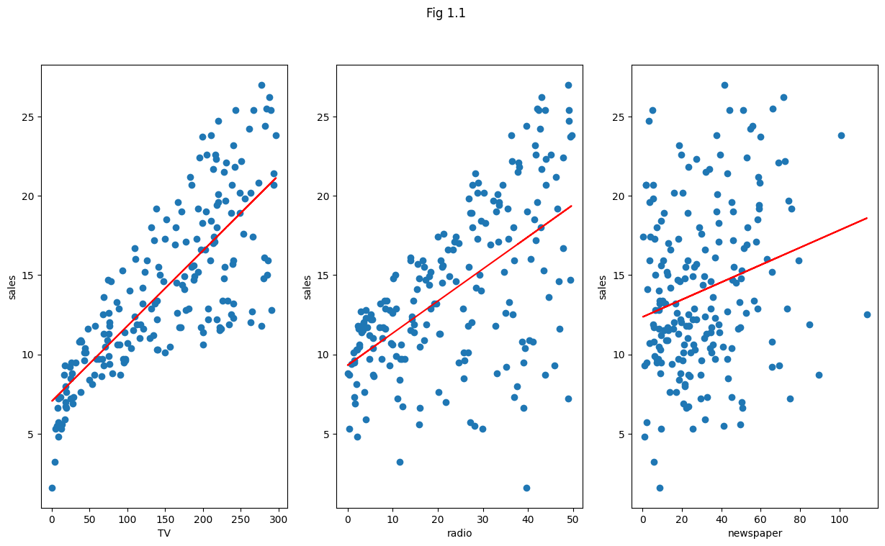
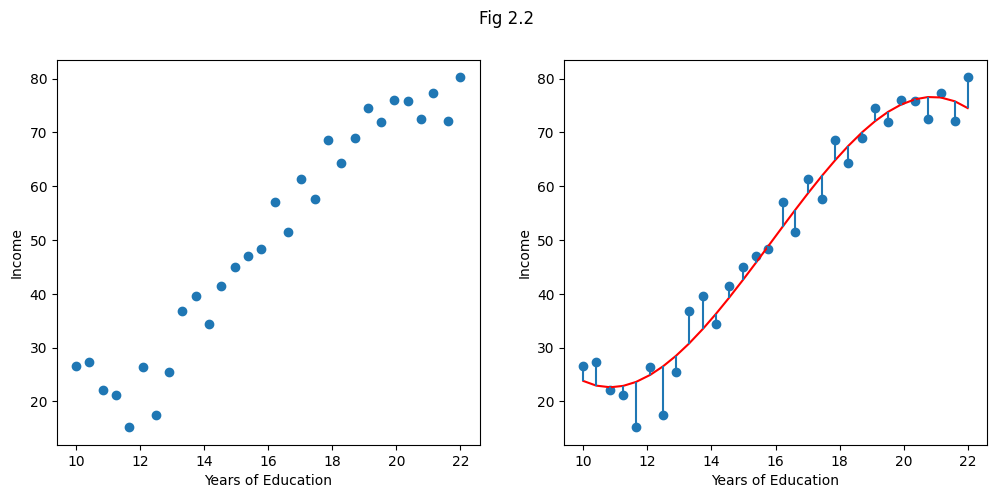
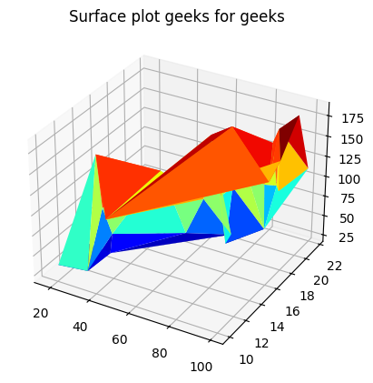
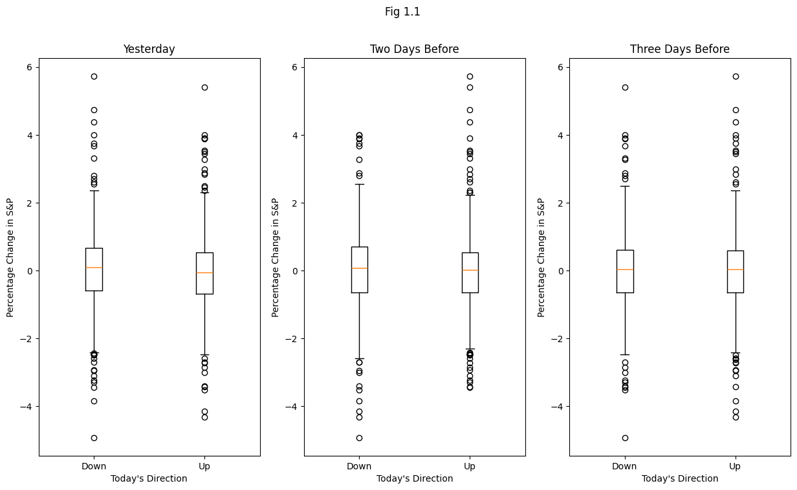
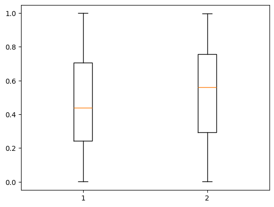

## What Is Statistical Learning?


```python

```


```python
import pandas as pd
import numpy as np
import matplotlib.pyplot as plt
from sklearn import linear_model # regressor
```


```python

```

### Advertising Data


```python
# get Advertising data
Advertising = pd.read_csv(r"D:\DATAPROJECTS\ISLR\data/ALL CSV FILES - 2nd Edition/Advertising.csv", index_col=0)
```


```python
Advertising.head()
```


<div>
<style scoped>
    .dataframe tbody tr th:only-of-type {
        vertical-align: middle;
    }

    .dataframe tbody tr th {
        vertical-align: top;
    }

    .dataframe thead th {
        text-align: right;
    }
</style>
<table border="1" class="dataframe">
  <thead>
    <tr style="text-align: right;">
      <th></th>
      <th>TV</th>
      <th>radio</th>
      <th>newspaper</th>
      <th>sales</th>
    </tr>
  </thead>
  <tbody>
    <tr>
      <th>1</th>
      <td>230.1</td>
      <td>37.8</td>
      <td>69.2</td>
      <td>22.1</td>
    </tr>
    <tr>
      <th>2</th>
      <td>44.5</td>
      <td>39.3</td>
      <td>45.1</td>
      <td>10.4</td>
    </tr>
    <tr>
      <th>3</th>
      <td>17.2</td>
      <td>45.9</td>
      <td>69.3</td>
      <td>9.3</td>
    </tr>
    <tr>
      <th>4</th>
      <td>151.5</td>
      <td>41.3</td>
      <td>58.5</td>
      <td>18.5</td>
    </tr>
    <tr>
      <th>5</th>
      <td>180.8</td>
      <td>10.8</td>
      <td>58.4</td>
      <td>12.9</td>
    </tr>
  </tbody>
</table>
</div>


### Figure 2.1


```python
fig, (ax1, ax2, ax3) = plt.subplots(1, 3,  figsize=(15, 8))
fig.suptitle('Fig 2.1')
# plot 1
# Fit with lm
regressor = linear_model.LinearRegression().fit(Advertising.loc[:,['TV']], Advertising.loc[:,'sales']) 
ax1.scatter(y = 'sales', x = 'TV', data = Advertising)
ax1.plot(Advertising.loc[:,['TV']], regressor.predict(Advertising.loc[:,['TV']]), '-r')
ax1.set_ylabel("sales"); ax1.set_xlabel("TV")
# plot 2
# Fit with lm
regressor = linear_model.LinearRegression().fit(Advertising.loc[:,['radio']], Advertising.loc[:,'sales']) 
ax2.scatter(y = 'sales', x = 'radio', data = Advertising)
ax2.plot(Advertising.loc[:,['radio']], regressor.predict(Advertising.loc[:,['radio']]), '-r')
ax2.set_ylabel("sales"); ax2.set_xlabel("radio")
# plot 3
regressor = linear_model.LinearRegression().fit(Advertising.loc[:,['newspaper']], Advertising.loc[:,'sales']) 
ax3.scatter(y = 'sales', x = 'newspaper', data = Advertising)
ax3.plot(Advertising.loc[:,['newspaper']], regressor.predict(Advertising.loc[:,['newspaper']]), '-r')
ax3.set_ylabel("sales"); ax3.set_xlabel("newspaper");
```


    

    


```python

```

### Income Dataset


```python
# get Income data
Income1 = pd.read_csv(r"D:\DATAPROJECTS\ISLR\data/ALL CSV FILES - 2nd Edition/Income1.csv", index_col=0)
```


```python
Income1.head()
```


<div>
<style scoped>
    .dataframe tbody tr th:only-of-type {
        vertical-align: middle;
    }

    .dataframe tbody tr th {
        vertical-align: top;
    }

    .dataframe thead th {
        text-align: right;
    }
</style>
<table border="1" class="dataframe">
  <thead>
    <tr style="text-align: right;">
      <th></th>
      <th>Education</th>
      <th>Income</th>
    </tr>
  </thead>
  <tbody>
    <tr>
      <th>1</th>
      <td>10.000000</td>
      <td>26.658839</td>
    </tr>
    <tr>
      <th>2</th>
      <td>10.401338</td>
      <td>27.306435</td>
    </tr>
    <tr>
      <th>3</th>
      <td>10.842809</td>
      <td>22.132410</td>
    </tr>
    <tr>
      <th>4</th>
      <td>11.244147</td>
      <td>21.169841</td>
    </tr>
    <tr>
      <th>5</th>
      <td>11.645485</td>
      <td>15.192634</td>
    </tr>
  </tbody>
</table>
</div>


```python
fig, (ax1, ax2) = plt.subplots(1, 2,  figsize=(12, 5))
fig.suptitle('Fig 2.2')
# plot 1
ax1.scatter(y = 'Income', x = 'Education', data = Income1)
ax1.set_ylabel("Income"); ax1.set_xlabel("Years of Education")
# plot 2
income_education_model = numpy.poly1d(numpy.polyfit(Income1.Education, Income1.Income, 3))
ax2.scatter(Income1.Education, Income1.Income)
ax2.plot(Income1.Education, income_education_model(Income1.Education), '-r')
ax2.vlines(Income1.Education, income_education_model(Income1.Education), Income1.Income) # just wanted to plot those error lines
ax2.set_ylabel("Income"); ax2.set_xlabel("Years of Education");
```


    

    


```python

```

### Income 2 Data


```python
# importing libraries
from mpl_toolkits import mplot3d
import numpy as np
import matplotlib.pyplot as plt
```


```python
# get Income data
Income2 = pd.read_csv(r"D:\DATAPROJECTS\ISLR\data/ALL CSV FILES - 2nd Edition/Income2.csv", index_col=0)
```


```python
Income2.head()
```


<div>
<style scoped>
    .dataframe tbody tr th:only-of-type {
        vertical-align: middle;
    }

    .dataframe tbody tr th {
        vertical-align: top;
    }

    .dataframe thead th {
        text-align: right;
    }
</style>
<table border="1" class="dataframe">
  <thead>
    <tr style="text-align: right;">
      <th></th>
      <th>Education</th>
      <th>Seniority</th>
      <th>Income</th>
    </tr>
  </thead>
  <tbody>
    <tr>
      <th>1</th>
      <td>21.586207</td>
      <td>113.103448</td>
      <td>99.917173</td>
    </tr>
    <tr>
      <th>2</th>
      <td>18.275862</td>
      <td>119.310345</td>
      <td>92.579135</td>
    </tr>
    <tr>
      <th>3</th>
      <td>12.068966</td>
      <td>100.689655</td>
      <td>34.678727</td>
    </tr>
    <tr>
      <th>4</th>
      <td>17.034483</td>
      <td>187.586207</td>
      <td>78.702806</td>
    </tr>
    <tr>
      <th>5</th>
      <td>19.931034</td>
      <td>20.000000</td>
      <td>68.009922</td>
    </tr>
  </tbody>
</table>
</div>


```python
from matplotlib import cm
from matplotlib.ticker import LinearLocator, FormatStrFormatter
from mpl_toolkits.mplot3d import Axes3D

fig, ax = plt.subplots(subplot_kw={"projection": "3d"})

# syntax for plotting
ax.plot_trisurf(
    Income2.Income, Income2.Education, Income2.Seniority, cmap=cm.jet, linewidth=0.2
)
ax.set_title('Surface plot geeks for geeks')
plt.show();
```


    

    


```python

```


```python

```


```python

```


```python

```


```python

```


```python

```


```python

```


```python

```


```python

```


```python

```


```python

```


```python

```


```python

```


```python

```


```python

```


```python

```


```python

```


```python

```


```python

```


```python

```

### Stock Market Data


```python
# get wages data
Smarket = pd.read_csv(r"D:\DATAPROJECTS\ISLR\data/ALL CSV FILES - 2nd Edition/Smarket.csv")
```


```python
Smarket.head()
```


<div>
<style scoped>
    .dataframe tbody tr th:only-of-type {
        vertical-align: middle;
    }

    .dataframe tbody tr th {
        vertical-align: top;
    }

    .dataframe thead th {
        text-align: right;
    }
</style>
<table border="1" class="dataframe">
  <thead>
    <tr style="text-align: right;">
      <th></th>
      <th>Year</th>
      <th>Lag1</th>
      <th>Lag2</th>
      <th>Lag3</th>
      <th>Lag4</th>
      <th>Lag5</th>
      <th>Volume</th>
      <th>Today</th>
      <th>Direction</th>
    </tr>
  </thead>
  <tbody>
    <tr>
      <th>0</th>
      <td>2001</td>
      <td>0.381</td>
      <td>-0.192</td>
      <td>-2.624</td>
      <td>-1.055</td>
      <td>5.010</td>
      <td>1.1913</td>
      <td>0.959</td>
      <td>Up</td>
    </tr>
    <tr>
      <th>1</th>
      <td>2001</td>
      <td>0.959</td>
      <td>0.381</td>
      <td>-0.192</td>
      <td>-2.624</td>
      <td>-1.055</td>
      <td>1.2965</td>
      <td>1.032</td>
      <td>Up</td>
    </tr>
    <tr>
      <th>2</th>
      <td>2001</td>
      <td>1.032</td>
      <td>0.959</td>
      <td>0.381</td>
      <td>-0.192</td>
      <td>-2.624</td>
      <td>1.4112</td>
      <td>-0.623</td>
      <td>Down</td>
    </tr>
    <tr>
      <th>3</th>
      <td>2001</td>
      <td>-0.623</td>
      <td>1.032</td>
      <td>0.959</td>
      <td>0.381</td>
      <td>-0.192</td>
      <td>1.2760</td>
      <td>0.614</td>
      <td>Up</td>
    </tr>
    <tr>
      <th>4</th>
      <td>2001</td>
      <td>0.614</td>
      <td>-0.623</td>
      <td>1.032</td>
      <td>0.959</td>
      <td>0.381</td>
      <td>1.2057</td>
      <td>0.213</td>
      <td>Up</td>
    </tr>
  </tbody>
</table>
</div>


```python
fig, (ax1, ax2, ax3) = plt.subplots(1, 3,  figsize=(15, 8))
fig.suptitle('Fig 1.1')
# plot 1
grouped = Smarket.groupby('Direction')['Lag1']
ax1.boxplot(x=[group.values for name, group in grouped],
           tick_labels= grouped.groups.keys() )
ax1.set_ylabel("Percentage Change in S&P"); ax1.set_xlabel("Today's Direction");
ax1.set_title("Yesterday")
# plot 2
grouped = Smarket.groupby('Direction')['Lag2']
ax2.boxplot(x=[group.values for name, group in grouped],
           tick_labels= grouped.groups.keys() )
ax2.set_title("Two Days Before")
ax2.set_ylabel("Percentage Change in S&P"); ax2.set_xlabel("Today's Direction");
# plot 3
grouped = Smarket.groupby('Direction')['Lag3']
ax3.boxplot(x=[group.values for name, group in grouped],
           tick_labels= grouped.groups.keys() )
ax3.set_title("Three Days Before")
ax3.set_ylabel("Percentage Change in S&P"); ax3.set_xlabel("Today's Direction");
```


    

    


```python
from sklearn.discriminant_analysis import QuadraticDiscriminantAnalysis
import numpy as np
```


```python
# train and test data
train_data = Smarket[Smarket['Year'] < 2005]
test_data = Smarket[Smarket['Year']>= 2005]
#
clf = QuadraticDiscriminantAnalysis()
clf.fit(train_data.iloc[:,0:8], train_data.loc[:,'Direction']);
```


```python
pred_data_test = pd.DataFrame(
    clf.predict_proba(test_data.iloc[:,0:8])
)
pred_data_test.columns = ["DOWN", "UP"]
```


```python
plt.boxplot(
    pred_data_test
);
```


    

    


```python

```

### Gene Expression Data


```python
# get wages data
# pd.read_csv(r"D:\DATAPROJECTS\ISLR\data/ALL CSV FILES - 2nd Edition/")
```


```python

```


```python

```
